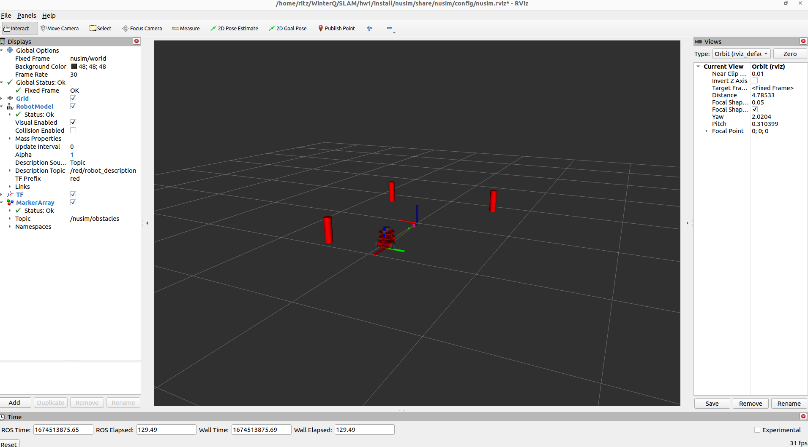

# Nusim
## Description:
This package provides a simulated environment for the turtle robot visualized in rviz. It is capable of tracking or setting the position of the robot and creating stationary obstacles in the environment.
* `ros2 launch nusim.launch.xml` to see the robot and obstacles in rviz.
* `ros2 run nusim nusim` to run just the nusim node without visualization in rviz.
## Launchfile:
The `nusim.launch.xml` launchfile launches the load_one.launch from nuturtle_description, the nusim node which loads parameters from the basic_world.yaml file and the rviz visualization node.
## Parameters:
*     rate (double): This is the rate in Hz at which the timer_callback runs.
*     x0 (double): This is the inital or home x position of the turtle robot.
*     y0 (double): This is the inital or home y position of the turtle robot.
*     theta0 (double): This is the inital or home theta configuration of the turtle robot.
*     obstacle/x (std::vector<double>): This is the desired x position of the turtle robot.
*     obstacle/y (std::vector<double>): This is the desired y position of the turtle robot.
*     obstacle/theta (double): This is the desired theta configuration of the turtle robot.
*     wheel_radius (double): The radius of the wheels.
*     track_width (double): The distance between the wheels.
*     motor_cmd_max(int): The motors are provided commands in [-motor_cmd_max, motor_cmd_max].
*     motor_cmd_per_rad_sec(double): Each motor command "tick" is 0.024 rad/sec.
*     encoder_ticks_per_rad(double): The number of encoder "ticks" per radian.
*     collision_radius(double): This is some simplified geometry used for collision detection.
*     walls.x_length(double): The length of the arena in the world x direction.
*     walls.y_length(double): The length of the arena in the world y direction.
*     draw_only(bool): Determines if only the walls and obstacles are published.
*     input_noise(double): The noise of the wheel velocity.
*     slip_fraction(double): The slip applied to the wheels.
*     basic_sensor_variance(double): The noise in the relative obstacle positions.
*     max_range(double): The range of detecting obstacles.
*     angle_min(double): The minimum angle of laser.
*     angle_max(double): The maximum angle of laser.
*     angle_increment(double): The angular increment in laser readings.
*     time_increment(double): The time increment of laser.
*     scan_time(double): The scan time of a laser reading.
*     range_min(double): The minimum detectable distance an object from lidar.
*     range_max(double): The maximum detectable distance an object from lidar.
*     noise_level(double): The noise in the range calculations.
*     samples(int): The number of samples for which range is calculated.

* Rviz as launched from nusim.launch.xml

