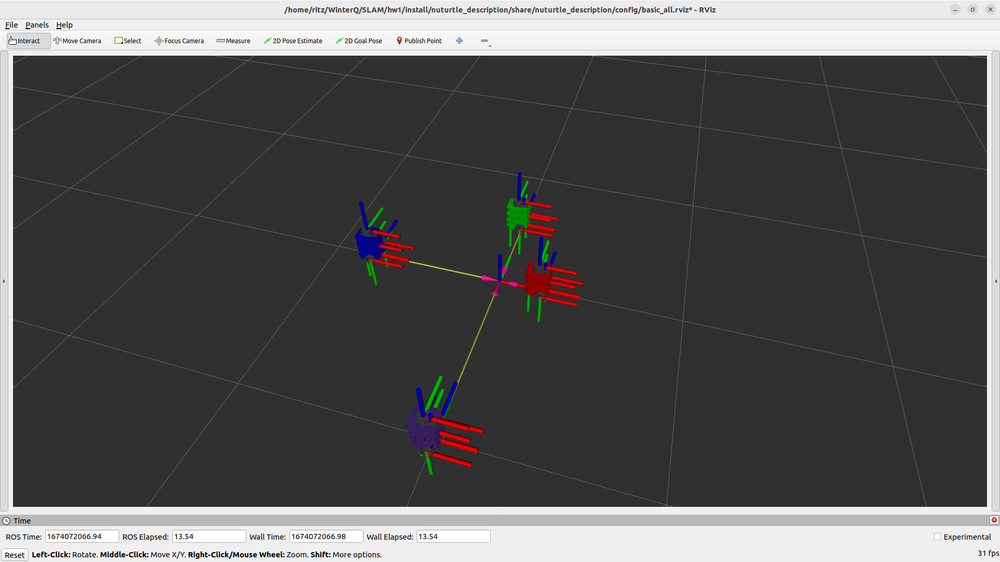

# Nuturtle  Description
URDF files for Nuturtle <Name Your Robot>
* `ros2 launch nuturtle_description load_one.launch.py` to see the robot in rviz.
* `ros2 launch nuturtle_description load_all.launch.xml` to see four copies of the robot in rviz.

* The rqt_graph when all four robots are visualized (Nodes Only, Hide Debug) is:

# Launch File Details
* `ros2 launch nuturtle_description load_one.launch.py --show-args`
  `Arguments (pass arguments as '<name>:=<value>'):`

    `'use_jsp':`
        `Enable joint_state_publisher_node. Valid choices are: ['true', 'false']`
        `(default: 'true')`

    `'model':`
        `Path to robot urdf file`
        `(default: '/home/ritz/WinterQ/SLAM/hw1/install/nuturtle_description/share/nuturtle_description/urdf/turtlebot3_burger.urdf.xacro')`

    `'use_rviz':`
        `Enable visualization in rviz. Valid choices are: ['true', 'false']`
        `(default: 'true')`

    `'color':`
        `Select the color of the turtlebot baselink. Valid choices are: ['purple', 'red', 'blue', 'green', '']`
        `(default: 'purple')`
* `ros2 launch nuturtle_description load_all.launch.xml --show-args `
  `Arguments (pass arguments as '<name>:=<value>'):`

    `'use_jsp':`
        `Enable joint_state_publisher_node. Valid choices are: ['true', 'false']`
        `(default: 'true')`

    `'model':`
        `Path to robot urdf file`
        `(default: '/home/ritz/WinterQ/SLAM/hw1/install/nuturtle_description/share/nuturtle_description/urdf/turtlebot3_burger.urdf.xacro')`

    `'use_rviz':`
        `Enable visualization in rviz. Valid choices are: ['true', 'false']`
        `(default: 'true')`

    `'color':`
        `Select the color of the turtlebot baselink. Valid choices are: ['purple', 'red', 'blue', 'green', '']`
        `(default: 'purple')`
Worked With: Allan Garcia Cassal
             Katie Hughes
             Sushma Chandra
             Rintaroh Shima
             Ava Zahedi
             Marno Nel
             Megan Sindelar
             Dilan Wijesinghe
             James Oubre
             Nick Morales